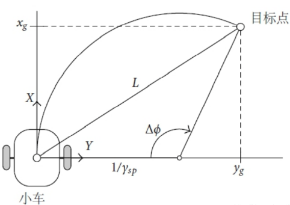
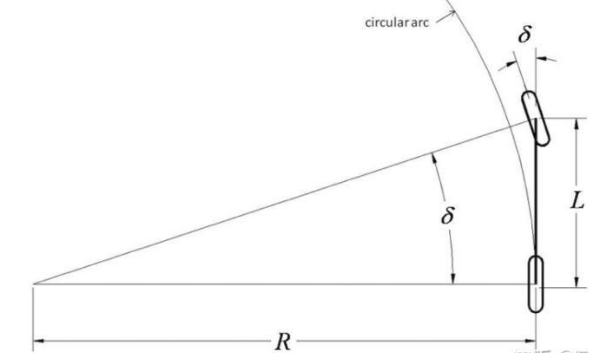

## pure_pursuit总结

### 1. 常见的路径跟踪算法

常见的路径跟踪算法可以分为**几何跟踪**和**模型跟踪**：

**几何跟踪**：基于车辆的运动学几何结构，推导出控制量实现跟踪，常见的几何跟踪算法有纯路径跟踪算法、Stanley method前轴控制、Rear_wheel_feedback后轴控制等，其中后两者基于阿克曼模型实现，而pp跟踪是在双轮乃至四轮差速模型和阿克曼模型中都有相应的应用。

**模型跟踪**：基于算法求解模型，结合机器人运动学与动力学的控制规律，通过最优解或稳定性调节等方式计算得到跟踪控制量的跟踪控制方式，常见的模型跟踪算法有很多，比如经典的PID控制、滑膜控制、线性二次型调节器控制、模型预测控制（MPC）等，不同的控制方式对应和不同的模型系统，可以是线性的，也可以是非线性的，可以使模型精度高的，也可以是不需要明确模型的，建模方式呈现多样化。

### 2. 纯路径跟踪算法和PID控制算法

下面将主要对纯路径跟踪pp算法以及PID跟踪算法进行原理实现及应用进行展开叙述。

### 2.1 Pure Pursuit(PP)纯跟踪算法

纯跟踪算法在低速情况下运用非常广泛，其主要原理基于机器人圆弧轨迹运动的特性，建立目标点和机器人当前位置之间的几何关系表达式，从而得出机器人当前时刻的角速度控制量。

以双轮差速移动机器人模型为例，根据机器人圆弧运动的特性，在物理学上得出小车运动线速度v，角速度w，以及运动半径之间的关系如下：
$$
w=v/r
$$
曲率与半径之间的固定关系如下：
$$
r=1/曲率
$$
<div align=center>

</div>

如图所示，以小车自身的局部坐标系为基准坐标系，小车当前位置为原点，目标点选定为P(x, y)。目标点与小车当前位置的距离L通常称之为前视距离，在坐标系中表达式如下：
$$
x^2+y^2=L^2
$$
另外，从圆弧的运动关系上可得：

$$
x=\sin(\Delta\varphi)r;y=(1-\cos(\Delta\varphi))r
$$
联立以上三式，可以得出基于前视距离和横向距离的运动半径表达式：
$$
r=L^2/2y
$$
在给定线速度的条件下，角速度的调节量为：
$$
w=v/r=2vy/L^2
$$

```c++
//代码块
```

---

单车模型实际上是对阿克曼转向几何的一个简化，使用单车模型需要做如下假设：

1.不考虑车辆在z轴方向的移动，只考虑xy水平面的移动；
2.左右侧车轮转角一致，这样就可以将左右侧车轮合并为一个轮胎，以便于搭建单车模型；
3.车辆行驶速度变化缓慢，忽略前后轴载荷的转移；
4.车身及悬架系统是刚性的。

采用单车模型的一大好处就在于它简化了前轮转向角和后轴将遵循的曲率之间的几何关系，其关系如下式所示：
<div align=center>

</div>

$$
\tan(\delta)=L/R
$$

其中&delta;表示前轮转角


